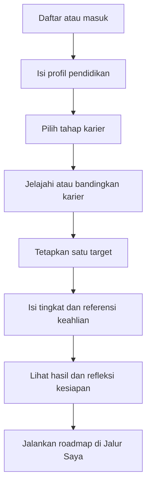
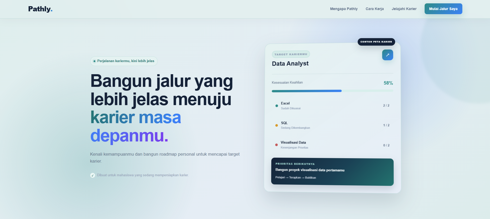
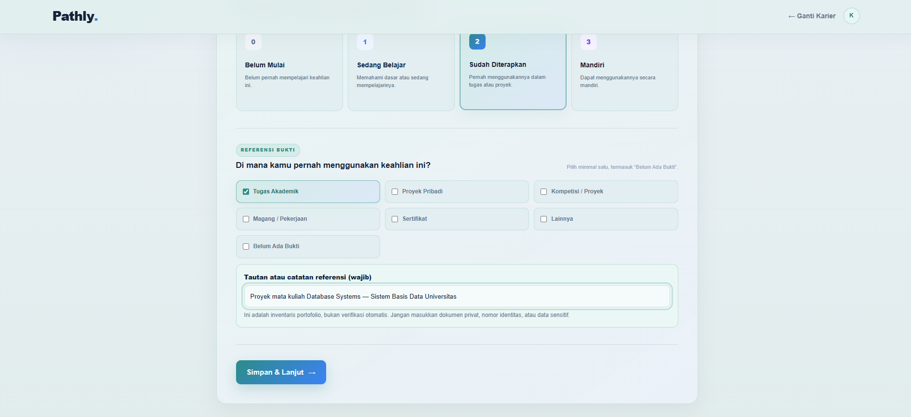
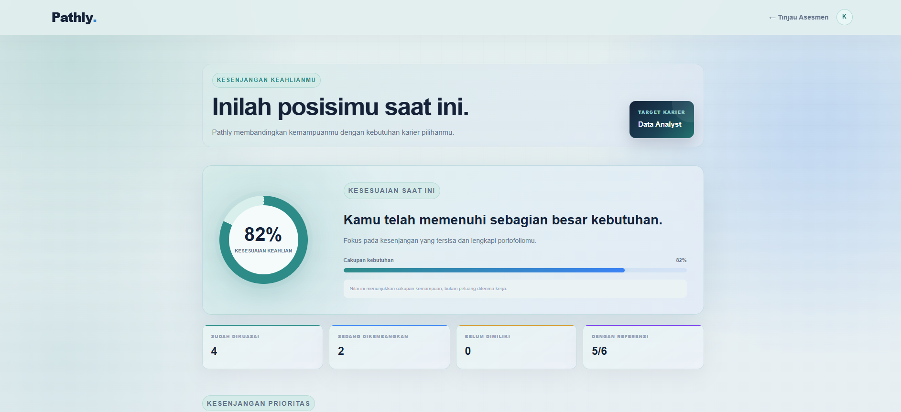
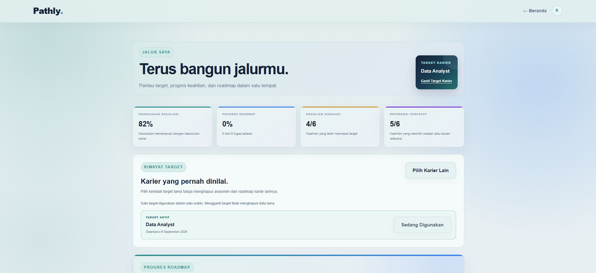
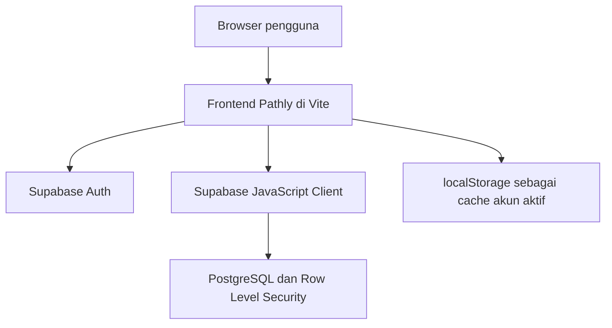

<div align="center">

# Pathly

### Kenali kemampuanmu, temukan kesenjangannya, dan bangun jalur kariermu.


**Submission Web Development ITECHNO CUP 2026 oleh VELORA**

</div>

> [!IMPORTANT]
> Sebelum submission, lengkapi tautan live demo, URL repository, dan screenshot pada bagian yang sudah ditandai.

## Status Kesiapan Submission

| Poin | Status | Bukti/Langkah |
| --- | --- | --- |
| Sumber lima karier dan aturan bobot | Selesai di repository | `docs/DATA-SOURCES.md` dan `js/requirements.js` |
| Pemisahan skor dan referensi bukti | Selesai di repository | Copy antarmuka, README, dan test transparansi |
| Dua pola keputusan untuk tiga konteks awal | Selesai di repository | `career-stage.html` dan alur perbandingan |
| Roadmap dengan estimasi adaptif dan definisi selesai | Selesai di repository | `js/roadmap.js` |
| Disclaimer refleksi non-CAAS | Selesai di repository | `readiness.html` dan bagian metode README |
| Privasi dan peringatan data sensitif | Selesai di repository | `privacy.html` dan persetujuan pendaftaran |
| Security headers Vercel | Selesai di repository | `vercel.json` |
| Deploy, redirect Supabase, dan uji dua akun | Tindakan pemilik | `docs/PRODUCTION-CHECKLIST.md` |
| Akun demo, screenshot production, dan URL README | Tindakan pemilik | Isi setelah deployment; jangan gunakan data pribadi |
| Uji 3–5 mahasiswa dan bukti dampak | Tindakan pemilik | Catat hasil nyata; jangan mengarang data pengujian |

## Daftar Isi

- [Tentang Proyek](#tentang-proyek)
- [Fitur Unggulan](#fitur-unggulan)
- [Alur Pengguna](#alur-pengguna)
- [Metode Penilaian](#metode-penilaian)
- [Demo dan Screenshot](#demo-dan-screenshot)
- [Teknologi](#teknologi)
- [Arsitektur Sistem](#arsitektur-sistem)
- [Struktur Proyek](#struktur-proyek)
- [Instalasi dan Setup](#instalasi-dan-setup)
- [Cara Penggunaan](#cara-penggunaan)
- [Testing](#testing)
- [Keamanan dan Privasi](#keamanan-dan-privasi)
- [Batasan dan Pengembangan Lanjutan](#batasan-dan-pengembangan-lanjutan)
- [Tim Pengembang](#tim-pengembang)
- [Lisensi](#lisensi)

## Tentang Proyek

### Latar Belakang

Mahasiswa sering sudah mengenal nama pekerjaan yang menarik, tetapi belum memiliki cara yang terstruktur untuk memahami kemampuan yang dibutuhkan, membandingkannya dengan kemampuan saat ini, serta menentukan langkah belajar yang harus diprioritaskan. Informasi karier yang tersebar juga mudah berhenti sebagai bacaan tanpa berubah menjadi rencana tindakan yang dapat dipantau.

### Solusi yang Ditawarkan

Pathly adalah aplikasi web kesiapan karier untuk mahasiswa D3, D4, dan S1. Pathly menghubungkan pemilihan target karier, asesmen tingkat keahlian, inventaris referensi bukti, perhitungan kesenjangan, refleksi non-diagnostik, dan roadmap personal dalam satu perjalanan yang tersimpan per akun.

Hasil Pathly bukan prediksi diterima kerja atau tes psikologis. Hasilnya berfungsi sebagai alat bantu untuk memahami posisi saat ini dan menyusun prioritas pengembangan yang lebih jelas.

### Tujuan Proyek

- **Tujuan utama:** membantu mahasiswa memetakan kemampuan saat ini, kebutuhan target karier, dan prioritas pengembangan yang dapat dipantau.
- **Target pengguna:** mahasiswa D3, D4, dan S1 yang sedang mengeksplorasi, membandingkan, atau mempersiapkan target karier.
- **Value proposition:** satu alur personal yang menghubungkan target karier, tingkat kemampuan, referensi hasil kerja, prioritas kesenjangan, dan progres roadmap.

### Kesesuaian Tema dan SDG

Pathly mendukung subtema **“Smart Sustainable Digital Solution for Inclusive Society”**, khususnya **[SDG 8: Pekerjaan Layak dan Pertumbuhan Ekonomi](https://sdgs.un.org/goals/goal8)**. Kontribusi yang dituju berkaitan dengan kesiapan menuju pekerjaan produktif (target 8.5) dan pengurangan pemuda yang tidak berada dalam pendidikan, pekerjaan, atau pelatihan (target 8.6). Hubungan ini adalah arah dampak produk; efektivitasnya belum diklaim sebelum uji pengguna dilakukan.

## Fitur Unggulan

| Fitur | Deskripsi | Nilai bagi Pengguna |
| --- | --- | --- |
| **Tiga konteks awal, dua pola keputusan** | Eksplorasi dan Persiapan mengarahkan pengguna memilih satu target; Validasi memungkinkan perbandingan 2–3 target. | Bahasa awal menyesuaikan situasi pengguna tanpa mengklaim tiga algoritma yang berbeda. |
| **Eksplorasi dan perbandingan karier** | Tersedia lima karier awal serta input pekerjaan impian. Pada mode membandingkan, pengguna dapat melihat 2-3 pilihan sebelum menetapkan satu target. | Membantu pengguna memahami perbedaan fokus dan keahlian tanpa memberi label “utama” atau “cadangan”. |
| **Asesmen dan inventaris referensi** | Setiap keahlian dinilai pada tingkat 0–3. Pengguna dapat mencatat kategori serta tautan/catatan hasil kerja, atau memilih “Belum Ada Bukti”. | Membantu inventaris portofolio. Pathly tidak memverifikasi referensi dan referensi tidak memengaruhi skor. |
| **Skor kesesuaian berbobot** | Kemampuan saat ini dibandingkan dengan target tingkat dan bobot keahlian untuk menghasilkan persentase kesesuaian. | Pengguna dapat melihat posisi saat ini dengan cara yang konsisten dan dapat ditelusuri. |
| **Prioritas kesenjangan** | Keahlian yang belum mencapai target diurutkan berdasarkan bobot, besar kesenjangan, dan statusnya. | Pengguna mengetahui hal yang perlu dikerjakan terlebih dahulu. |
| **Refleksi adaptabilitas non-diagnostik** | Delapan pernyataan buatan Pathly mencakup perhatian, kendali, rasa ingin tahu, dan kepercayaan diri. | Membantu refleksi tanpa mengklaim sebagai CAAS tervalidasi atau tes psikologi. |
| **Roadmap Pelajari-Terapkan-Buktikan** | Tiga gap terbesar diubah menjadi tugas dengan estimasi belajar awal yang menyesuaikan status kemampuan dan definisi selesai. | Saran berkembang menjadi langkah yang lebih dapat dijalankan dan diperiksa. |
| **Jalur Saya** | Target, hasil asesmen, roadmap, progres tugas, dan riwayat karier ditampilkan dalam satu halaman. Pengguna dapat mengganti target aktif tanpa menghapus hasil karier sebelumnya. | Progres mudah dipantau dan diperbarui tanpa mengisi semuanya dari awal. |
| **Akun dan sinkronisasi data** | Autentikasi, pemulihan kata sandi, dan penyimpanan data per pengguna menggunakan Supabase. | Perjalanan karier tetap tersedia saat pengguna kembali pada sesi berikutnya. |

### Karier Awal yang Tersedia

1. Data Analyst
2. Business Analyst
3. Front-End Developer
4. UI/UX Designer
5. Digital Marketing Specialist

Pengguna juga dapat menuliskan pekerjaan impiannya. Pathly akan meminta klarifikasi apabila nama yang dimasukkan masih terlalu umum dan hanya menawarkan pilihan yang didukung oleh pemetaan keahlian yang tersedia.

## Alur Pengguna



## Metode Penilaian

### Skor Kesesuaian Keahlian

Untuk setiap keahlian, Pathly menghitung cakupan kemampuan:

```text
coverage = min(userLevel / targetLevel, 1)
```

Skor akhir dihitung menggunakan bobot tiap keahlian:

```text
alignment = round(sum(weight × coverage) / sum(weight) × 100)
```

Level pengguna menggunakan skala berikut:

| Level | Label | Makna |
| --- | --- | --- |
| 0 | Belum Mulai | Belum pernah mempelajari keahlian tersebut. |
| 1 | Sedang Belajar | Memahami dasar atau sedang mempelajarinya. |
| 2 | Sudah Diterapkan | Pernah menggunakan keahlian dalam tugas atau proyek. |
| 3 | Mandiri | Dapat menggunakan keahlian secara mandiri. |

Keahlian yang belum mencapai target dimasukkan ke daftar prioritas. Urutannya mempertimbangkan bobot kebutuhan, besar selisih level, dan apakah keahlian masih berstatus belum dimiliki.

Kategori dan catatan referensi dihitung terpisah sebagai **cakupan referensi**. Referensi tidak mengubah `coverage`, `alignment`, status keahlian, atau urutan gap. Pathly juga tidak membuka maupun memverifikasi keaslian dokumen/tautan.

### Sumber Data Karier

Daftar keahlian dipetakan manual menggunakan profil pekerjaan O\*NET, taksonomi ESCO, portal SKKNI Kemnaker, dan snapshot lowongan Indonesia. Lima padanan profil utamanya adalah Business Intelligence Analysts, Management Analysts, Web Developers, Web and Digital Interface Designers, serta Search Marketing Strategists.

Bobot **Inti (3, target level 2)** dan **Penting (2, target level 1)** adalah heuristik prioritas belajar Pathly, bukan ambang rekrutmen atau standar resmi. Metode, tautan sumber per karier, sampel lokal, batasan, dan aturan pembaruan dicatat di [`docs/DATA-SOURCES.md`](docs/DATA-SOURCES.md). Provenance ringkas juga ditampilkan aplikasi melalui `window.PATHLY_DATA_PROVENANCE` di `js/careers.js`.

Data ditinjau terakhir pada **5 September 2026** dan direncanakan ditinjau ulang setiap semester atau ketika terdapat perubahan signifikan pada kebutuhan pasar kerja.

### Dasar Refleksi Adaptabilitas

Empat dimensi refleksi—perhatian, kendali, rasa ingin tahu, dan kepercayaan diri—mengacu pada kerangka career adaptability dalam [Savickas & Porfeli (2012)](https://www.marksavickas.com/files/1_Savickas_bio/Interviews/Savickas%20Publications/Journal%20Articles/CAAS_International.pdf). Instrumen CAAS pada penelitian tersebut memiliki 24 item; delapan pernyataan di Pathly ditulis sendiri untuk refleksi produk dan tidak boleh diperlakukan sebagai CAAS, tes psikologi, atau alat ukur tervalidasi.

## Demo dan Screenshot

- **Live demo:** [https://pathly-velora.vercel.app](https://pathly-velora.vercel.app/)
- **Repository GitHub:** [https://github.com/keisyaazzahrakamall-png/PATHLY](https://github.com/keisyaazzahrakamall-png/PATHLY)
- **Video demo (opsional):** Belum tersedia.

Sebelum submission, simpan screenshot di `docs/screenshots/`, lalu tampilkan pada bagian ini. Screenshot yang disarankan:

1. Landing page Pathly.
2. Halaman asesmen keahlian dan referensi.
3. Hasil kesesuaian serta prioritas kesenjangan.
4. Roadmap atau halaman Jalur Saya.

Contoh penulisan setelah file screenshot tersedia:

```md




```

## Teknologi

### Tech Stack

| Bagian | Teknologi | Penggunaan |
| --- | --- | --- |
| Frontend | HTML5, CSS3, Vanilla JavaScript | Antarmuka multi-halaman, responsivitas, validasi, dan logika interaksi. |
| Module system | ES Modules | Memisahkan bootstrap halaman, autentikasi, akses data, dan scoring. |
| Build tool | Vite 8 | Development server, optimasi, dan production build. |
| Authentication | Supabase Auth | Pendaftaran, konfirmasi email, login, logout, sesi, dan reset kata sandi. |
| Database | PostgreSQL melalui Supabase | Menyimpan profil, perjalanan karier, asesmen, hasil kesiapan, roadmap, dan progres tugas. |
| Data access | `@supabase/supabase-js` | Menghubungkan frontend dengan Auth dan database Supabase. |
| Security | PostgreSQL Row Level Security dan security headers | Membatasi data berdasarkan pemilik akun dan memperkuat perlindungan browser. |
| Testing | Node.js Test Runner | Menguji scoring, keamanan input, toggle password, dan kontrak antarmuka. |

### Alasan Pemilihan Teknologi

- **Vanilla HTML, CSS, dan JavaScript** dipilih agar alur produk dapat dibangun khusus untuk Pathly tanpa template instan atau framework UI.
- **Vite** menyediakan development server yang cepat dan production build untuk seluruh halaman aplikasi.
- **Supabase** menyediakan autentikasi dan PostgreSQL dalam satu layanan sehingga data pengguna dapat tersimpan lintas sesi.
- **Row Level Security** memastikan setiap pengguna hanya dapat membaca dan mengubah data miliknya sendiri.
- **Node.js Test Runner** menjaga pengujian tetap ringan tanpa menambah framework testing lain.

### Dependency Utama

```json
{
  "dependencies": {
    "@supabase/supabase-js": "^2.113.0"
  },
  "devDependencies": {
    "vite": "^8.2.2"
  }
}
```

## Arsitektur Sistem



Data utama disimpan pada PostgreSQL Supabase. `localStorage` hanya digunakan sebagai cache agar transisi halaman terasa cepat. Cache ditandai dengan ID pemilik dan dibersihkan apabila akun aktif berubah.

### Skema Database

| Tabel | Fungsi |
| --- | --- |
| `profiles` | Profil pendidikan dan pengalaman pengguna. |
| `career_journeys` | Tahap, target, perbandingan, dan karier kustom pengguna. |
| `assessments` | Jawaban tingkat kemampuan dan bukti per karier. |
| `career_readiness` | Refleksi adaptabilitas dan hasil perhitungan kesiapan. |
| `roadmaps` | Roadmap personal yang dihasilkan dari hasil asesmen. |
| `roadmap_tasks` | Status penyelesaian setiap tugas roadmap. |

Seluruh tabel memiliki Row Level Security dan kebijakan akses berdasarkan `auth.uid()`.

## Struktur Proyek

```text
pathly/
├── index.html                     # Landing page
├── login.html                     # Masuk akun
├── signup.html                    # Pendaftaran akun
├── privacy.html                   # Ringkasan privasi MVP
├── onboarding.html                # Profil pendidikan
├── career-stage.html              # Pemilihan tahap karier
├── career.html                    # Eksplorasi dan perbandingan karier
├── assessment.html                # Asesmen tingkat dan bukti keahlian
├── results.html                   # Hasil kesesuaian keahlian
├── readiness.html                 # Ringkasan kesiapan dan refleksi
├── roadmap.html                   # Roadmap Pelajari-Terapkan-Buktikan
├── my-path.html                   # Dashboard perjalanan pengguna
├── css/                           # Gaya halaman dan komponen
├── js/
│   ├── auth/                      # Autentikasi dan manajemen sesi
│   ├── lib/                       # Supabase, data pengguna, input safety, scoring
│   ├── pages/                     # Bootstrap setiap halaman
│   ├── careers.js                 # Data karier dan provenance
│   ├── requirements.js            # Bobot serta target keahlian
│   ├── assessment.js              # Alur asesmen
│   ├── readiness.js               # Ringkasan kesiapan
│   └── roadmap.js                 # Penyusunan roadmap
├── supabase/
│   └── migrations/                # Skema database dan kebijakan RLS
├── docs/                           # Sumber data dan checklist produksi
├── tests/                         # Pengujian otomatis
├── package.json                   # Scripts dan dependency
├── vercel.json                    # Security headers production Vercel
└── vite.config.js                 # Build multi-page dan server lokal
```

## Instalasi dan Setup

### Prasyarat

- Node.js `^20.19.0` atau `>=22.12.0`
- npm
- Git
- Akun dan proyek Supabase hanya jika ingin memakai backend sendiri

### 1. Clone Repository

```bash
git clone https://github.com/keisyaazzahrakamall-png/PATHLY.git
cd PATHLY
```

### 2. Install Dependency

```bash
npm ci
```

Gunakan `npm install` apabila `package-lock.json` belum tersedia.

### 3. Konfigurasi Supabase

Salinan submission sudah terhubung ke konfigurasi publik Supabase milik Pathly, sehingga dapat dijalankan tanpa membuat file `.env`.

Jika ingin menggunakan proyek Supabase lain:

1. Salin `.env.example` menjadi `.env`.
2. Isi environment variable berikut dengan URL dan publishable key milik proyek tersebut.

```env
VITE_SUPABASE_URL=https://your-project-id.supabase.co
VITE_SUPABASE_PUBLISHABLE_KEY=your-publishable-key
```

3. Jalankan `supabase/migrations/001_initial_schema.sql` satu kali melalui Supabase SQL Editor.
4. Pada menu **Authentication > URL Configuration** di Supabase, atur **Site URL** ke domain production serta izinkan `confirm-email.html` dan `reset-password.html`. Gunakan URL production yang tepat, bukan contoh placeholder.

Panduan lengkap deployment, redirect, uji dua akun, akun demo, screenshot, dan uji pengguna tersedia di [`docs/PRODUCTION-CHECKLIST.md`](docs/PRODUCTION-CHECKLIST.md).

> [!WARNING]
> Jangan pernah memasukkan Supabase `service_role` key ke dalam frontend atau repository. Frontend hanya boleh menggunakan publishable/anon key yang dilindungi oleh Row Level Security.

### 4. Jalankan Development Server

```bash
npm run dev
```

Buka alamat yang ditampilkan Vite, biasanya `http://localhost:5173`.

### 5. Production Build

```bash
npm run build
npm run preview
```

Hasil build tersedia di folder `dist/`. Konfigurasi submission disiapkan untuk **Vercel**: gunakan `npm run build` sebagai build command dan `dist` sebagai output directory. `vercel.json` menerapkan security headers pada response production.

## Cara Penggunaan

1. Buka Pathly dan pilih **Mulai Jalur Saya**.
2. Buat akun, lakukan konfirmasi email apabila diminta, lalu masuk.
3. Isi profil pendidikan dan pengalaman.
4. Pilih konteks awal karier:
   - **Eksplorasi:** untuk pengguna yang belum memiliki pilihan.
   - **Membandingkan:** untuk pengguna yang sedang mempertimbangkan 2-3 karier.
   - **Persiapan:** untuk pengguna yang sudah memiliki target tertentu.
5. Jelajahi karier, bandingkan pilihan bila diperlukan, lalu tetapkan satu target.
6. Untuk setiap keahlian, pilih level 0–3 dan kategori referensi. Jika belum memiliki hasil yang dapat dicatat, pilih **Belum Ada Bukti**. Jangan memasukkan dokumen privat atau data sensitif.
7. Selesaikan asesmen untuk melihat skor kesesuaian dan prioritas kesenjangan.
8. Isi refleksi adaptabilitas, kemudian buka roadmap.
9. Jalankan langkah **Pelajari-Terapkan-Buktikan** sesuai estimasi dan definisi selesai, lalu centang tugas yang selesai.
10. Buka **Jalur Saya** untuk memantau progres, mengganti target aktif, membuka kembali karier yang pernah dinilai, memperbarui asesmen, atau kembali ke beranda.

### Perintah Proyek

```bash
# Menjalankan development server
npm run dev

# Menjalankan seluruh pengujian
npm test

# Membuat production build
npm run build

# Menjalankan test lalu build
npm run check

# Meninjau hasil production build
npm run preview
```

## Testing

Jalankan seluruh pemeriksaan sebelum commit atau deployment:

```bash
npm run check
```

Pengujian otomatis saat ini mencakup:

- normalisasi dan keamanan input karier;
- perhitungan skor berbobot serta prioritas kesenjangan;
- validasi bahwa asesmen sesuai dengan target karier;
- deteksi ada/tidaknya kategori referensi;
- perilaku tombol tampil/sembunyikan kata sandi;
- alur konfirmasi email dan pemulihan kata sandi;
- keberadaan file lokal yang dirujuk halaman;
- kontrak tombol dan navigasi utama;
- keberadaan konfigurasi publik Supabase;
- ketentuan alur profil, Jalur Saya, dan eksplorasi karier.

Verifikasi terakhir pada salinan submission ini menghasilkan **57 test lulus** dan **production build berhasil**.

## API dan Akses Data

Pathly tidak memiliki custom REST API. Aplikasi memakai Supabase JavaScript Client untuk mengakses Supabase Auth dan tabel PostgreSQL. Operasi data dibatasi oleh autentikasi serta Row Level Security pada database.

Modul akses data utama tersedia di `js/lib/user-data.js`, sedangkan konfigurasi client berada di `js/lib/supabase.js`.

## Keamanan dan Privasi

- Seluruh data perjalanan dikaitkan dengan ID pengguna yang sedang login.
- Row Level Security aktif pada enam tabel utama.
- Role `anon` tidak diberi akses langsung ke tabel data pengguna.
- Cache browser dipisahkan berdasarkan pemilik akun dan dibersihkan saat akun berubah.
- Input pekerjaan kustom dinormalisasi, dibatasi panjangnya, dan disaring dari pola berbahaya.
- Vite menerapkan security headers pada development/preview; `vercel.json` menerapkan Content Security Policy, `X-Content-Type-Options`, `X-Frame-Options`, Permissions Policy, dan Referrer Policy pada production Vercel.
- Pathly hanya meminta data yang diperlukan untuk profil pendidikan dan perjalanan karier.
- Pengguna diperingatkan untuk tidak memasukkan dokumen privat, nomor identitas, atau data sensitif pada catatan referensi.
- Menu **Reset Perjalanan** menghapus target, asesmen, refleksi, roadmap, dan progres, tetapi mempertahankan akun serta profil pendidikan.

Ringkasan yang juga terlihat sebelum pendaftaran tersedia pada [`privacy.html`](privacy.html). Penghapusan akun penuh belum tersedia secara mandiri pada MVP.

## Batasan dan Pengembangan Lanjutan

### Batasan Versi Saat Ini

- Data karier dan bobot keahlian dikurasi manual dari sumber yang dicatat dan belum diperbarui dari lowongan secara otomatis.
- Kategori referensi wajib dipilih, tetapi pengguna boleh memilih **Belum Ada Bukti**. Pathly tidak memeriksa kredibilitas dokumen/tautan dan referensi tidak memengaruhi skor.
- Daftar karier awal masih terbatas; input karier kustom hanya dapat diproses jika memiliki pemetaan keahlian yang didukung.
- Skor merupakan panduan prioritas belajar, bukan jaminan kesiapan atau penerimaan kerja.
- Delapan pernyataan adaptabilitas dibuat Pathly dengan inspirasi empat dimensi career adaptability; ini bukan CAAS 24 item, belum tervalidasi secara psikometrik, dan bukan diagnosis.
- Dampak SDG 8 masih berupa kontribusi yang dituju; uji pengguna 3–5 mahasiswa belum boleh diklaim sebelum dilakukan.

### Rencana Pengembangan

- memperluas katalog karier dan menambah variasi sumber Indonesia per karier;
- membuat proses peninjauan data berkala dengan catatan versi;
- mempertimbangkan verifikasi kualitas referensi hanya dengan persetujuan dan desain privasi yang memadai;
- mengembangkan dashboard tren progres lintas waktu;
- melakukan pengujian pengguna dengan mahasiswa D3, D4, dan S1.

## Tim Pengembang

| Nama | Peran | GitHub/Portofolio |
| --- | --- | --- |
| Keisya Azzahra Kamal | Project Lead, UI/UX & Full-Stack Developer | [GitHub](https://github.com/keisyaazzahrakamall-png) |

**Nama tim:** VELORA  
**Kategori peserta:** Individu

## Lisensi

Copyright © 2026 Keisya Azzahra Kamal / VELORA. Proyek ini dibuat untuk submission Web Development ITECHNO CUP 2026. Belum ada lisensi open-source yang diberikan; penggunaan ulang memerlukan izin dari pemilik proyek.

---

<div align="center">

**Dibuat oleh VELORA untuk ITECHNO CUP 2026**

</div>
